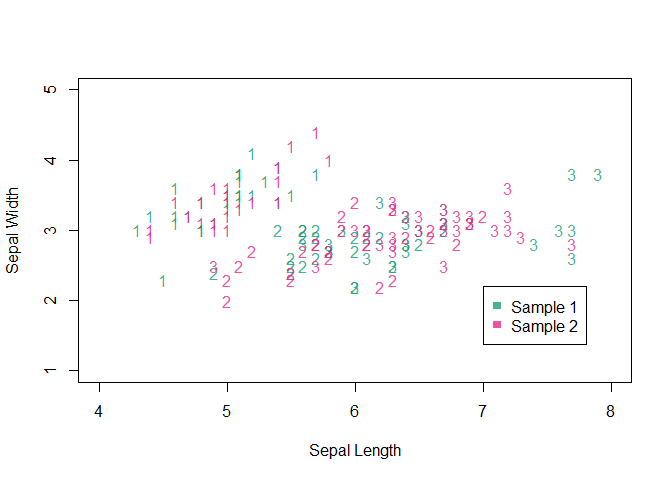

## Overview

`distdiffR` is an R package for bivariate two-sample tests of distributional equality.

The package provides a collection of nonparametric permutation tests for distributional equality. The tests make use of statistics between empirical cumulative distribution functions averaged across a series of rotations and or toroidal shifts of the pooled samples. The variety of tests with their respective parameters can be called from the main function `distdiffr()`. It takes as input two bivariate samples (not necessarily the same size) in the form of two-column matrices.

## Application (when no difference exists)

Below is an example using Fisher's Iris data[^1] to show test results when the null hypotheses are true (and both distributions are equivalent). This is done by randomly assigning all three of the species of iris to two samples. Since this is a bivariate test of distributional equality, only the first two independent variables are used.


```r
library(distdiffR)

seedNum <- 123
set.seed(seedNum)

data(iris)
# Randomly assign all three species to two samples
iris <- iris[sample.int(nrow(iris)), ]
sample1 <- as.matrix(iris[1:75, 1:2])
sample2 <- as.matrix(iris[76:150, 1:2])
pooled_data <- rbind(cbind(sample1, 1), cbind(sample2, 2))

plot(pooled_data[, 1],
     pooled_data[, 2],
     xlim = c(4, 8),
     ylim = c(1, 5),
     col = c("#1b9e77cc", "#e7298acc")[pooled_data[, 3]],
     pch = c(2, 1)[pooled_data[, 3]],
     pty = "s",
     xlab = "Sepal Length",
     ylab = "Sepal Width")
legend(7, 2.2,
       legend = c("Sample 1", "Sample 2"),
       pch = c(2, 1),
       col = c("#1b9e77cc", "#e7298acc"))
```


```r
# Rotational test
output <- distdiffr(sample1, # Note: Data inputs must be matrices
                    sample2,
                    testType = "rotational",
                    seedNum = seedNum)
output$pval
```

```
#> [1] 0.561
```

Since the p-value (`pval`) is much larger than any reasonable significance level, the null is confidently rejected in favor of the null hypothesis, which is that these two samples have been drawn from the same distribution. When `testType = "rotational"`, McKinney and Symanzik's rotational modified Syrjala test[^2] is being employed.

### Test modifications

Similar results are also shown for the more powerful toroidal and combined (rotational and toroidal) modified Syrjala tests[^3]:


```r
# Toroidal shift test with proportions of points
output <- distdiffr(sample1,
                    sample2,
                    testType = "toroidal",
                    propPnts = 0.1,
                    seedNum = seedNum)
output$pval
```

```
#> [1] 0.566
```

```r
# Toroidal shift test with thresholds below pooled sample size
output <- distdiffr(sample1,
                    sample2,
                    testType = "toroidal",
                    shiftThrshld = 25, # Default
                    seedNum = seedNum)
output$pval
```

```
#> [1] 0.477
```

```r
# Toroidal shift test with thresholds above pooled sample size
output <- distdiffr(sample1,
                    sample2,
                    testType = "toroidal",
                    shiftThrshld = 100,
                    seedNum = seedNum)
output$pval
```

```
#> [1] 0.502
```

```r
# Toroidal shift test with a number of shifts
output <- distdiffr(sample1,
                    sample2,
                    testType = "toroidal",
                    numShifts = 8,
                    seedNum = seedNum)
output$pval
```

```
#> [1] 0.648
```

```r
# Combined rotational and toroidal shift test
output <- distdiffr(sample1,
                    sample2,
                    testType = "combined", # Default
                    seedNum = seedNum)
output$pval
```

```
#> [1] 0.307
```
### Alternative test statistics

Six alternative statistics are available for each type of test. However, as seen here, the choice among these statistics has been shown to make little difference on the test results[^3].


```r
output <- distdiffr(sample1,
                    sample2,
                    testType = "combined",
                    psiFun = CalcPsiDWS,
                    seedNum = 1231)
output$pval
```

```
#> [1] 0.254
```

```r
output <- distdiffr(sample1,
                    sample2,
                    testType = "combined",
                    psiFun = CalcPsiUWS,
                    seedNum = 1232)
output$pval
```

```
#> [1] 0.279
```

```r
output <- distdiffr(sample1,
                    sample2,
                    testType = "combined",
                    psiFun = CalcPsiCWS, # Default
                    seedNum = seedNum)
output$pval
```

```
#> [1] 0.307
```

```r
output <- distdiffr(sample1,
                    sample2,
                    testType = "combined",
                    psiFun = CalcPsiDWA,
                    seedNum = 1233)
output$pval
```

```
#> [1] 0.234
```

```r
output <- distdiffr(sample1,
                    sample2,
                    testType = "combined",
                    psiFun = CalcPsiUWA,
                    seedNum = 1234)
output$pval
```

```
#> [1] 0.263
```

```r
output <- distdiffr(sample1,
                    sample2,
                    testType = "combined",
                    psiFun = CalcPsiCWA,
                    seedNum = 1235)
output$pval
```

```
#> [1] 0.347
```

### Input order does not matter

Additionally, for any of the above tests, the data input order is arbitrary, e.g.,


```r
output1 <- distdiffr(sample1,
                     sample2,
                     seedNum = seedNum)

output2 <- distdiffr(sample2,
                     sample1,
                     seedNum = seedNum)

output1$pval == output2$pval
```

```
#> [1] FALSE
```

## Application (when a difference exists)

Below demonstrates test results when the null hypothesis is false (i.e., there exists some difference between the two distributions). This is shown by separating the two samples by the species Setosa and Virginica, respectively.


```r
data(iris)
sample1 <- as.matrix(iris[iris[5] == "setosa", -(3:5)])
sample2 <- as.matrix(iris[iris[5] == "virginica", -(3:5)])
pooled_data <- rbind(cbind(sample1, 1), cbind(sample2, 2))

plot(pooled_data[, 1],
     pooled_data[, 2],
     xlim = c(4, 8),
     ylim = c(1, 5),
     col = c("#7570b3cc", "#d95f02cc")[pooled_data[, 3]],
     pch = c(2, 1)[pooled_data[, 3]],
     pty = "s",
     xlab = "Sepal Length",
     ylab = "Sepal Width")
legend(6.6, 2.2,
       legend = c("Sample 1 (Setosa)", "Sample 2 (Virginica)"),
       pch = c(2, 1),
       col = c("#7570b3cc", "#d95f02cc"))
```


Indeed, the difference between the two samples results in minimal p-values among all of the test types.


```r
# Rotational test
output <- distdiffr(sample1,
                    sample2,
                    testType = "rotational",
                    seedNum = seedNum)
output$pval
```

```
#> [1] 0.001
```

```r
# Toroidal shift test with proportions of points
output <- distdiffr(sample1,
                    sample2,
                    testType = "toroidal",
                    propPnts = 0.1,
                    seedNum = seedNum)
output$pval
```

```
#> [1] 0.001
```

```r
# Toroidal shift test with thresholds below pooled sample size
output <- distdiffr(sample1,
                    sample2,
                    testType = "toroidal",
                    seedNum = seedNum)
output$pval
```

```
#> [1] 0.001
```

```r
# Toroidal shift test with thresholds above pooled sample size
output <- distdiffr(sample1,
                    sample2,
                    testType = "toroidal",
                    shiftThrshld = 100,
                    seedNum = seedNum)
output$pval
```

```
#> [1] 0.001
```

```r
# Toroidal shift test with a number of shifts
output <- distdiffr(sample1,
                    sample2,
                    testType = "toroidal",
                    numShifts = 8,
                    seedNum = seedNum)
output$pval
```

```
#> [1] 0.001
```

```r
# Combined rotational and toroidal shift test
output <- distdiffr(sample1,
                    sample2,
                    testType = "combined",
                    seedNum = seedNum)
output$pval
```

```
#> [1] 0.001
```

## The grouped_distdiffr() test

Another version of the test also exists when combining bivariate data from multiple sources (e.g., subjects) into each of the two-samples, respectively. This test treats each subject's contribution equally. It can be called via the `grouped_distdiffr()` function. The plot below labels the species Setosa, Virsicolor, and Virginica as the integers 1, 2, and 3, respectively.


```r
data(iris)
# Randomly assign all three species to two samples
iris$Species <- rep(1:3, each = 50)
iris <- iris[sample.int(nrow(iris)), ]
sample1 <- as.matrix(iris[1:75, c(1:2, 5)])
sample2 <- as.matrix(iris[76:150, c(1:2, 5)])
pooled_data <- rbind(cbind(sample1, 1), cbind(sample2, 2))

plot(pooled_data[, 1],
     pooled_data[, 2],
     xlim = c(4, 8),
     ylim = c(1, 5),
     col = c("#1b9e77cc", "#e7298acc")[pooled_data[, 4]],
     pch = c("1", "2", "3")[pooled_data[, 3]],
     pty = "s",
     xlab = "Sepal Length",
     ylab = "Sepal Width")
legend(7, 2.2,
       legend = c("Sample 1", "Sample 2"),
       pch = c(15, 15),
       col = c("#1b9e77cc", "#e7298acc"))
```



Since the species is treated as a subject labeling, then each subject's contributions to the respective samples can be grouped and weighted such that each contribution is treated equally. For example, although `sample1` had 28 Setosas, 23 Virsicolors, and 24 Virginicas, the contributions of each to the overall test statistic will be weighted equally. This is also true of `sample2`.


```r
output <- grouped_distdiffr(sample1,
                            sample2,
                            seedNum = seedNum)
```

```
#> [1] "Some data values were not unique between groups. Adding an insignificant amount of noise."
```

```r
output$pval
```

```
#> [1] 0.16
```

[^1]: Fisher, R. A., 1936. The use of multiple measurements in taxonomic problems. Annals of Eugenics, 7, Part II, pp. 179–188.

[^2]: McKinney, E., Symanzik, J., 2019. Modifications of the Syrjala Test for Testing Spatial Distribution Differences Between Two Populations, In: 2019 JSM Proceedings. American Statistical Association, Alexandria, VA. pp. 2518-2530.

[^3]: McKinney, E., Symanzik, J., 2021. Extensions to the Syrjala Test with Eye-Tracking Analysis Applications, In: 2021 JSM Proceedings. American Statistical Association, Alexandria, VA. In print.
